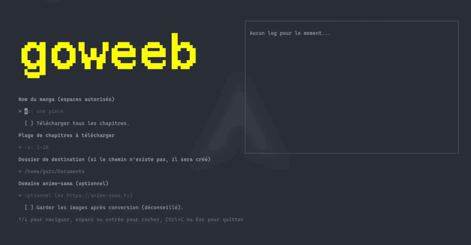

# goweeb-sama

> [!NOTE]
> English below but kind of useless since this utility is intended to dynamically download
> manga scans in **french** on a **french** website :)



**goweeb-sama** est un outil très rapide permettant de télécharger proprement les scans de ton manga préféré
depuis le site **anime-sama** (qui fait un excellent travail d'ailleurs, merci à vous).

## Installation

L'installation est très simple, il suffit d'aller dans l'onglet **[Releases](https://github.com/EliasLd/goweeb-sama/releases/latest)** et de télécharger la dernière version **TUI** de l'outil pour ton système d'exploitation.

### Windows
1. Télécharge l'archive pour windows
2. Place l'exécutable dans un dossier de ton choix
3. Ouvre un terminal (PowerShell ou CMD) dans ce dossier et utilise l'outil

### Linux / macOS
1. Télécharge l'archive correspondant à ton système (*darwin* pour macos)
2. Rends-le exécutable : `chmod +x goweeb`
3. (Optionnel) Déplace-le dans `/usr/local/bin` pour l'utiliser depuis n'importe où

## Utilisation

**goweeb-sama** est disponible en deux versions :

### Interface graphique (TUI) - Recommandé pour les débutants

Lance simplement l'exécutable TUI :

```bash
# Linux / macOS
./goweeb

# Windows
goweeb.exe
```

Laisse-toi guider par l'interface interactive !

- Saisis le nom du manga que tu recherches
- Choisis parmi les résultats trouvés
- Sélectionne la version (couleur/noir et blanc, VF/VA)
- Configure tes options de téléchargement
- Lance le téléchargement et suis la progression en temps réel

### Ligne de commande (CLI) - Pour les utilisateurs avancés

### Format du nom de manga

**Important** : Le nom du manga doit être entré **entre guillemets**. Tu peux utiliser n'importe quel terme de recherche (titre français, anglais, ou japonais).

Exemples :
- `"one piece"`
- `"jujutsu kaisen"`
- `"chainsaw man"`
- `"attaque des titans"`

Si plusieurs résultats correspondent à ta recherche, l'outil te proposera de choisir le bon manga dans une liste interactive.

### Syntaxe de base

```bash
goweeb [options] "nom-du-manga"
```

### Options disponibles

| Option | Raccourci | Description |
|--------|-----------|-------------|
| `--all` | `-a` | Télécharge tous les chapitres disponibles |
| `--range <plage>` | `-r` | Spécifie une plage de chapitres (ex: `10-77`, `4` chapitre 4 uniquement, `14-` du chapitre 14 jusqu'à la fin, `-5` pour les 5 derniers chapitres par exemple) |
| `--scan-dir <dossier>` | `-d` | Dossier où sauvegarder les PDF (par défaut : `pdf`) |
| `--keep-images` | `-k` | Garde les images après la création du PDF |
| `--domain <url>` | `-u` | Remplace le domaine anime-sama (ex: `https://anime-sama.tv`) |
| `--ebook-friendly ` | aucun | Télécharge les chapitres au format image dans des dossiers  séparés (e.g. Chapter 001/, Chapter 002/). Compatible avec [Kindle Comic Converter](https://github.com/ciromattia/kcc). |
| `--debug ` | aucun | Active le mode debug pour avoir plus de logs (CLI uniquement) |

### Exemples d'utilisation

#### Télécharger tous les chapitres d'un manga
```bash
goweeb --all "one piece"
# ou
goweeb -a "jujutsu kaisen"
```

#### Télécharger une plage de chapitres
```bash
# Chapitres 10 à 77
goweeb --range 10-77 "jujutsu kaisen"

# Raccourci
goweeb -r 10-50 "one piece"

# Du chapitre 14 jusqu'au dernier disponible
goweeb -r 14- "chainsaw man"

# Les 3 derniers chapitres
goweeb -r -3 "ao ashi"
```

#### Spécifier un dossier de destination
```bash
# Les PDF seront sauvegardés dans le dossier "mes-mangas"
goweeb -d mes-mangas --all "naruto"

# Ou avec le chemin complet (sous linux)
goweeb --scan-dir ~/Documents/Mangas -r 1-100 "one piece"

# Pareil mais sur Windows
goweeb --scan-dir C:\Users\<nom-de-ton-utilisateur>\Documents\Mangas -r 1-100 "one piece"
```

#### Spécifier un domaine personnalisé
```bash
# Si le domaine anime-sama change
goweeb -u https://anime-sama.fr --all "one piece"
```

#### Télécharger une structure compatible avec une liseuse

> [!WARNING]
> Il ne s'agit pas de télécharger le manga dans un format EPUB ou autre, mais plutôt de le télécharger
> en suivant une structure particulière utilisée par des logiciels tiers pour formatter les manga à la lecture sur liseuse.

Par exemple, ce mode est très utile pour convertir le manga téléchargé avec [Kindle Comic Converter](https://github.com/ciromattia/kcc)
et ensuite l'upload sur une kindle, kobo ou autre e-reader.

```bash
goweeb -u https://anime-sama.fr --all --ebook-friendly "one piece"
```

#### Combinaison d'options
```bash
# Télécharge les chapitres 1 à 50 de One Piece, dans le dossier "scans" sur Windows 
# en spécifiant un domaine anime-sama personnalisé
goweeb -r 1-50 -d 'C:\Users\<nom-de-ton-utilisateur>\scans' -u https://anime-sama.tv "one piece"
```

### Conseils

> [!TIP]
> - La recherche utilise directement le moteur de recherche d'anime-sama, tu peux donc utiliser n'importe quel nom (français, anglais, japonais)
> - Si plusieurs versions d'un scan existent (ex: couleur/noir et blanc), l'outil te demandera laquelle télécharger
> - N'oublie pas les guillemets autour du nom du manga !

> [!WARNING] 
> Garde bien en tête que le domaine d'anime-sama change pour des raisons évidentes... donc n'hésite pas à vérifier [anime-sama.pw](https://anime-sama.pw) pour vérifier quel domaine est actif. Tu peux ensuite le spécifier avec l'argument `-u` comme présenté ci-dessus.

---

## 🇬🇧 English Version

**goweeb-sama** is a fast tool to download manga scans from the French website **anime-sama** (which does an excellent job by the way, thanks to them).

## Installation

Installation is very simple, just go to the **Releases** tab on the right side of the GitHub interface and download the latest **TUI** version of the tool for your operating system.

### Windows
1. Download the Windows archive
2. Place it in a folder of your choice
3. Open a terminal (PowerShell or CMD) in that folder and use the tool

### Linux / macOS
1. Download the archive corresponding to your system (*darwin* for macos)
2. Make it executable: `chmod +x goweeb`
3. (Optional) Move it to `/usr/local/bin` to use it from anywhere

## Usage

**goweeb-sama** is available in two versions:

### Graphical Interface (TUI) - Recommended for beginners

Simply launch the TUI executable:

```bash
# Linux / macOS
./goweeb

# Windows
goweeb.exe
```

Let the interactive interface guide you!

- Enter the manga name you're searching for
- Choose from the search results
- Select the version (color/black and white, VF/VA)
- Configure your download options
- Start downloading and follow the progress in real-time

### Command Line (CLI) - For advanced users

### Manga name format


**Important**: The manga name must be entered **in quotes**. You can use any search term (French, English, or Japanese title).

Examples:
- `"one piece"`
- `"jujutsu kaisen"`
- `"chainsaw man"`
- `"attack on titan"`

If multiple results match your search, the tool will let you choose the correct manga from an interactive list.

### Basic syntax

```bash
goweeb [options] "manga-name"
```

### Available options

| Option | Shortcut | Description |
|--------|----------|-------------|
| `--all` | `-a` | Download all available chapters |
| `--range <range>` | `-r` | Specify a range of chapters (e.g., `10-77`, `14-`) |
| `--scan-dir <folder>` | `-d` | Folder to save PDF files (default: `pdf`) |
| `--keep-images` | `-k` | Keep images after PDF creation |
| `--domain <url>` | `-u` | Override anime-sama domain (e.g., `https://anime-sama.tv`) |

### Usage examples

#### Download all chapters of a manga
```bash
goweeb --all "one piece"
# or
goweeb -a "jujutsu kaisen"
```

#### Download a range of chapters
```bash
# Chapters 10 to 77
goweeb --range 10-77 "jujutsu kaisen"

# Shortcut
goweeb -r 10-50 "one piece"

# From chapter 14 to the last available
goweeb -r 14- "chainsaw man"
```

#### Specify a destination folder
```bash
# PDFs will be saved in the "my-mangas" folder
goweeb -d my-mangas --all "naruto"

# Or with the full path
goweeb --scan-dir ~/Documents/Mangas -r 1-100 "one piece"
```

#### Specify a custom domain
```bash
# If the anime-sama domain changes
goweeb -u https://anime-sama.fr --all "one piece"
```

#### Combining options
```bash
# Download chapters 1 to 50 of One Piece, in the "scans" folder on Windows
# while specifying a custom anime-sama domain
goweeb -r 1-50 -d 'C:\Users\<your-username>\scans' -u https://anime-sama.tv "one piece"
```

### Tips

> [!TIP]
> - The search uses anime-sama's search engine directly, so you can use any name (French, English, Japanese)
> - If multiple scan versions exist (e.g., color/black and white), the tool will ask which one to download
> - Don't forget the quotes around the manga name!

> [!WARNING] 
> Keep in mind that the anime-sama domain changes for obvious reasons... so don't hesitate to check [anime-sama.pw](https://anime-sama.pw) to verify which domain is active. You can then specify it with the `-u` argument as shown above.

---

## Crédits

Merci beaucoup à Anime Sama et leur travail colossal sans qui ce projet ne pourrait exister <3
